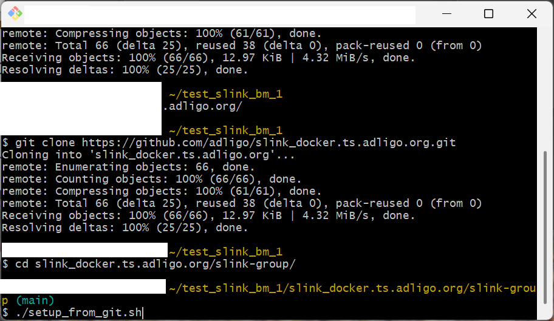

# Workflow 1) Build Everything Locally

This workflow requires that you setup your machine with node and GitBash;

Step 1) [Install Node.js](https://nodejs.org/en/download) click on the nodejs.org link at the left and follow the installation instructions.  I was on version v24.2.0 when I wrote this but any version after that should work as well.

Step 2) [Install GitBash](https://git-scm.com/install/) click on the git-scm.com link at the left and follow the installation instructions.  I was on version v2.51.2 (ReleaseNotes.html where you installed it) when I wrote this but if you install GitBash it will auto update often and keep you on a current version which should work well.

Step 3) [Install SLink](https://www.npmjs.com/package/@ts.adligo.org/slink), note this is somewhat counter intuitive [@see note](https://github.com/adligo/slink_bm.ts.adligo.org/tree/main?tab=readme-ov-file#slink-historical-notes);

```
npm install -g @ts.adligo.org/slink
```

Step 4) Clone this repository from github.com from the GitBash command prompt with the following command;

```
git clone https://github.com/adligo/slink_bm.ts.adligo.org.git
```

Step 5) Download the dependencies, and run the full build and tests

```
cd slink_bm.ts.adligo.org/slink-group/
./setup_from_github_https.sh
```

Make sure you are using the setup_from_github_https.sh script and NOT the setup_from_github.sh script as your not a maintainer of the project.  The above script should take a few minutes as it clones a lot of other repositories, it should look something like the following;



Step 6) Now you can run the following build and test commands at any point;

```
npm run build
npm run tests
```

Also note that these command simply call the library projects using the order in [buildSrc/projects.cjs](buildSrc/projects.cjs), you can also work on any of those projects there.  If you want to commit back to github create a fork of the project your working on and work on your fork, then when you have somthing to review let the [Adligo Discord Community](https://github.com/adligo/overview.adligo.org?tab=readme-ov-file#community) know.

##### Note:

This is used to build (and potentially release) all of the Adligo.org dependencies used by SLink.  This was the way all of the SLink code and dependencies were originally created.
