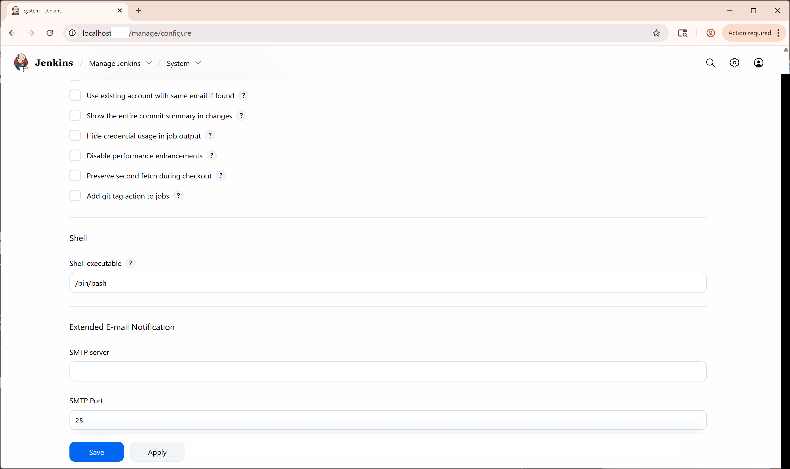
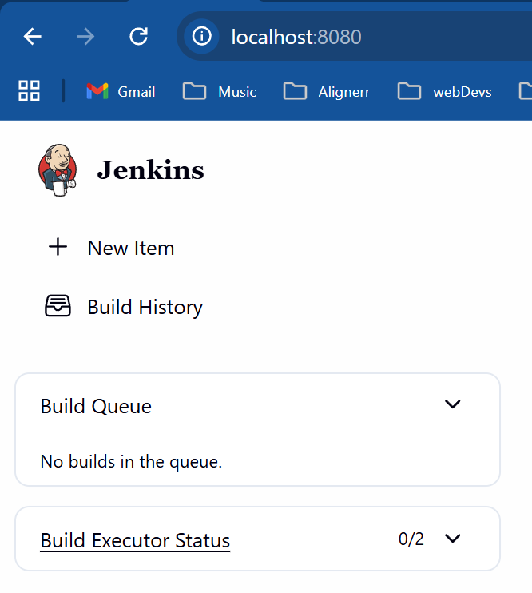
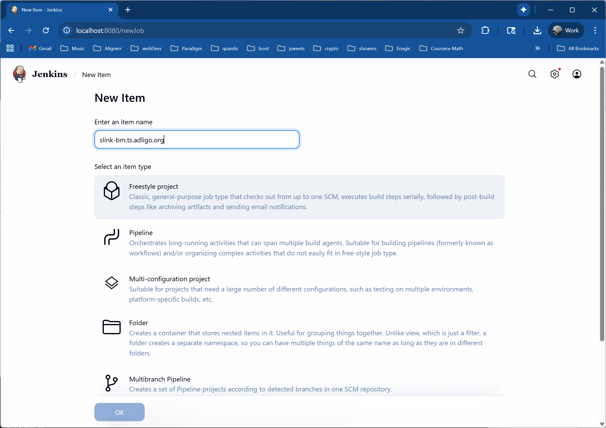

# Workflow 3) Build In Jenkins from Github

Workflow 3 can be done either in Jenkins running inside of Docker, or Jenkins running on your local machine.

## 3.a) Jenkins in Docker

### Step 3.a.1) 

[DockerDesktop](https://docs.docker.com/desktop/) Click on the link at the left and scroll to the bottom in order to install Docker Desktop.

### Step 3.a.2)

[Install GitBash](https://git-scm.com/install/) click on the git-scm.com link at the left and follow the installation instructions.  I was on version v2.51.2 (ReleaseNotes.html where you installed it) when I wrote this but if you install GitBash it will auto update often and keep you on a current version which should work well.

### Step 3.a.3)

Clone this repository with something like;

```
git clone https://github.com/adligo/slink_bm.ts.adligo.org.git
```

### Step 3.a.4)

Start Docker Desktop, open a Git Bash prompt and run these commands;

```
cd slink_bm.ts.adligo.org/jenkins
docker build --progress=plain -t slink-bm3 .
docker run -d -p 8528:8080 --name slink-bm3-c4 slink-bm3
```

### Step 3.a.5)

Set the shell to /bin/bash in Jenkins Management;




## 3.b) Jenkins directly on your local machine

<strong><b>Note:</b></strong> You will want to do this if you are a maintainer, since you will be able to see if you break the build on GitHub before you send source code there.

### Step 3.b.1)

You will need to install Java, follow the instructions here;

[https://openjdk.org/](https://openjdk.org/)

### Step 3.b.2)

Install and Run Jenkins, use the war file;

[https://www.jenkins.io/download/](https://www.jenkins.io/download/)

i.e.
Generic Java package (.war)
bfa31f1e3aacebb5bce3d5076c73df97bf0c0567eeb8d8738f54f6bac48abd74

Then from the GitBash command line;

```
java -jar jenkins.war --enable-future-java
```


...
## 3.c) Setup the Jenkins Build

Once you have Jenkins up install the default dependencies and setup your administrator users then;


#### 3.c.2) Setup the Job(s)

Once you have Jenkins up and running create a 'New Item';



Then use a freestyle project;



### 3.c.3) Use the jenkins.sh for your 'Execute Shell' build steps;

#### Optional Steps

[Optional Step 1) jenkins_echo_adligo_docker_id.sh](../jenkins/jenkins_echo_adligo_docker_id.sh) 
[Optional Step 2) jenkins_clean.sh](../jenkins/jenkins_clean.sh) 

#### Build Steps

[Build Step 1) jenkins.sh](../jenkins/jenkins.sh) 

##### Note:

This is the CI (Continuous Integration) part of the CICD (Continuous Integration Continuous Delivery) system and can be hosted locally or in Docker.  Delivery is also known as releasing (See work flows 1 and 2).