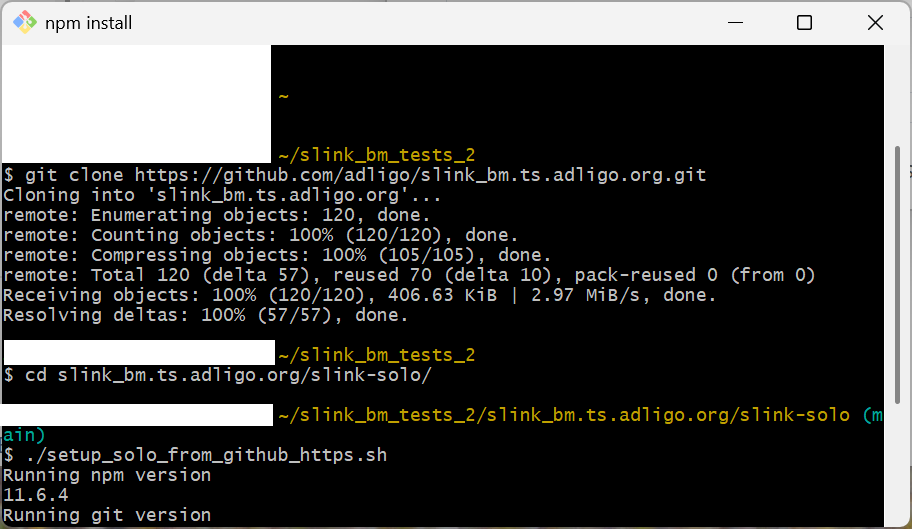

# Workflow 2) Build Solo Locally

### Step 1)

 [Install Node.js](https://nodejs.org/en/download) click on the nodejs.org link at the left and follow the installation instructions.  I was on version v24.2.0 when I wrote this but any version after that should work as well.

### Step 2)

[Install GitBash](https://git-scm.com/install/) click on the git-scm.com link at the left and follow the installation instructions.  I was on version v2.51.2 (ReleaseNotes.html where you installed it) when I wrote this but if you install GitBash it will auto update often and keep you on a current version which should work well.

### Step 3)

Clone this repository from github.com from the GitBash command prompt with the following command;

```
git clone https://github.com/adligo/slink_bm.ts.adligo.org.git
```

### Step 4)

Download the dependencies, and run the full build and tests

```
cd slink_bm.ts.adligo.org/slink-solo/
./setup_solo_from_github_https.sh
```

Make sure you are using the <strong><b>setup_solo_from_github_https.sh</b></strong> script and <strong><b>NOT</b></strong> the <strong><b>setup_solo_from_github.sh</b></strong> script as your not a maintainer of the project.  The above script should take a few minutes as it clones a lot of other repositories, it should look something like the following;



### Step 5)

Now you can run the following build which installs slink on your machine from source.

```
npm run build
slink -v
```

##### Note:

This is used to build (and release) SLink itself, and is useful if you want to focus on the SLink code. 